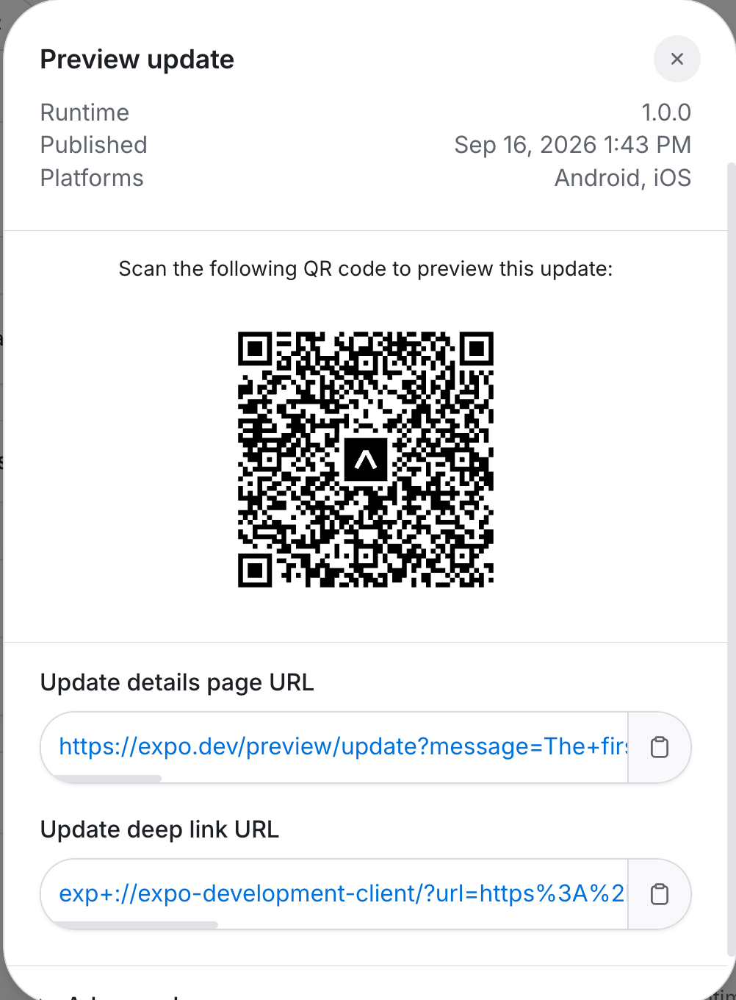

exercises from the course: https://fullstackopen.com/en/

Rate Repository App
_____________________
A mobile application for rating Github Rep. Users can browse, view and rate repo and crate review commentary.
Part of Full Stack Open part 10 exercises.

Try the App by scanning the QR CODE:

